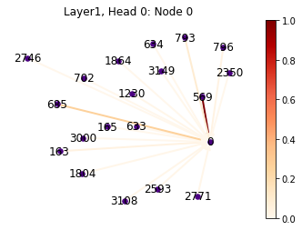
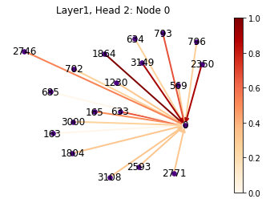
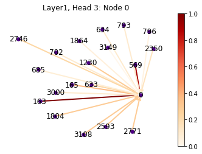
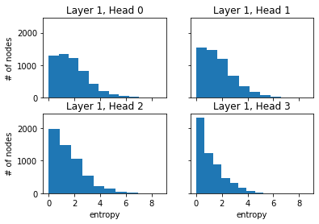

# Graph Neural Networks Notebook

Jupyter notebook for building [Graph Attention Networks (GATs)](https://arxiv.org/abs/1710.10903) using `PyTorch` and `PyTorch Geometric`.

## Graph Attention Networks

There are two limitations of [graph convolutional networks (GCN)](https://tkipf.github.io/graph-convolutional-networks/).
The first limitation is GCN optimization depends on the global graph structure, since the graph Laplacian is needed. Thus it may not generalize well to completely unseen graph.

Another limitation of GCN is that it assigns equal importance of self-loops and edges to neighboring nodes. 
The normalization constant solely depends on the graph structure, i.e. 
$$\frac{1}{\sqrt{deg(v_i) deg(v_j)}}$$

This may not be a problem when most neighbors are equally important. But the assumption will not hold for every datasets. 
So is there a way to assign **arbitrary importances** to different neighbors? The answer is yes, that is **graph attention networks** (GAT, Veličković et al. 2017), it employs self-attention mechanism to allow each node find out which neighbors they should pay more attention to (give higher importance).

We define $\vec{h}_i^{(l)}$ as the feature vector of node *i* at layer *l*, $\mathbf{W}$ is the shared node-wise weight matrix, $\mathcal{N}_i$ as the neighborhood of node *i*, and $\alpha_{ij}$ as the importance of node *j*'s feature to node *i* at layer *l*.
$$\vec{h}_i^{(l+1)} = \sigma \left( \sum_{j \in \mathcal{N}_i} \alpha_{ij}\mathbf{W}\vec{h}_j^{(l)} \right)$$

Instead of explicitly defined the importance $\alpha_{ij}$ or as learnable weight, the authors **implicitly** define $\alpha_{ij}$ by employing self-attention mechanism *a*:
$$e_{ij} = a \left( \mathbf{W}\vec{h}_i^{(l)}, \mathbf{W}\vec{h}_j^{(l)} \right)$$

Here, *a* is single-layer neural network with weight vector $\vec{\mathbf{a}}$ and nonliear function *LeakyReLU* i.e. a leaky version of a ReLU allows a small gradient on negative input:
$$e_{ij} = \text{LeakyReLU}\left( {\vec{\mathbf{a}}}^T \left[ \mathbf{W}\vec{h}_i^{(l)} \parallel \mathbf{W} \vec{h}_j^{(l)} \right] \right)$$

where $\parallel$ is the concatenation operation.

Then, $e_{ij}$ is normalized across all choices of *j* from $\mathcal{N}_i$:
$$\alpha_{ij} = \text{softmax}_j (e_{ij}) =  \frac{\text{exp}(e_{ij})}{\sum_{k\in\mathcal{N}_i} \text{exp} (e_{ik})}$$

### Regularization by Multi-Head Attention
The authors further proposed a regularization process by applying *K* independent attention mechanisms with different parameters, then aggregate by either concatenating (hidden layer) or averaging (output layer) together:
$$\text{Concatenate}: \vec{h}_i^{(l+1)} = \; \parallel_{k=1}^K \sigma \left( \sum_{j \in \mathcal{N}_i} \alpha_{ij}^{k} \mathbf{W}^{k}\vec{h}_j^{(l)} \right)$$

$$\text{Average}: \vec{h}_i^{(l+1)} = \sigma \left( \frac{1}{K} \sum_{k=1}^K \sum_{j \in \mathcal{N}_i} \alpha_{ij}^{k} \mathbf{W}^{k}\vec{h}_j^{(l)} \right)$$

### Understanding Attention Heads Learned
To better understand the reason why GAT performs better than GCN, let's take a look at the attention $\alpha_{ij}$ it learned.

First, let's visualize how the incoming attention distribute for a single node at the first layer. Let's draw the learned attention of node 0 over its incoming edges, and color the edges by their attention value.

From the four graphs, we can see that different attention heads show distinct pattern, each favors different neighbors. For most heads, the attentions are not uniformly distributed among the neighborhood, i.e. only a small subset of neighboring nodes have very high importance.

A more quantitative analysis is to calculate the entropy of the attention distribution over the incoming edges to each node.
$$H(\alpha_i) = - \sum_{j\in \mathcal{N}_i} \alpha_{ij} \log_2{\alpha_{ij}}$$

Draw the histograms of attention entropy for each head.

As a reference, simulate the case when the attention distribution is uniform for all nodes.

As we can see, the actual attention entropy distribution is completely skewed compare to uniform distribution. It's likely that the learned attention can help the model assgin more importaince to more relevant neighboring nodes, therefore making it performs better than GCN.